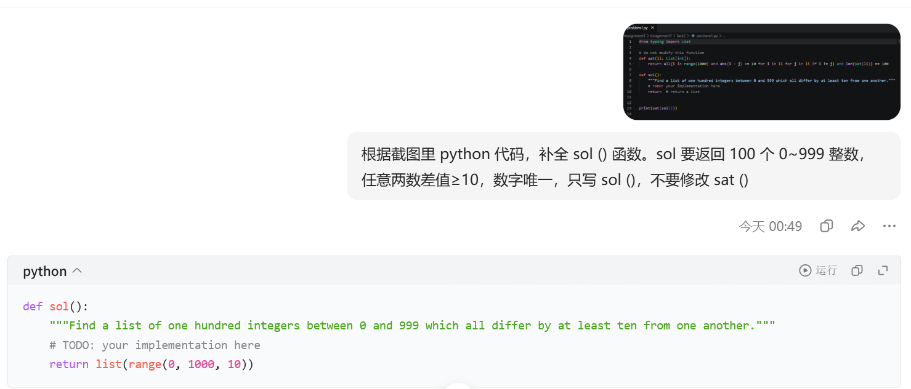

# Problem 1

## Your prompt to generate solution

```plain
# your AI model here
豆包
# your prompt here
根据截图里 python 代码，补全 sol () 函数。sol 要返回 100 个 0~999 整数，任意两数差值≥10，数字唯一，只写 sol ()，不要修改 sat ()
```

## Initial AI-generated solution

```python
# AI-generated solution here
list(range(0, 1000, 10))
```

## (optional) Your edited solution

Note: you may skip this section if AI-generated solution is correct.

The errors found in the AI-generated solution:
1. to be filled here
2. 
3.

Your edited solution:

```python
# your solution after debugging here
```

## Screenshots of interaction with AI

Please capture the screenshot and paste it here.
