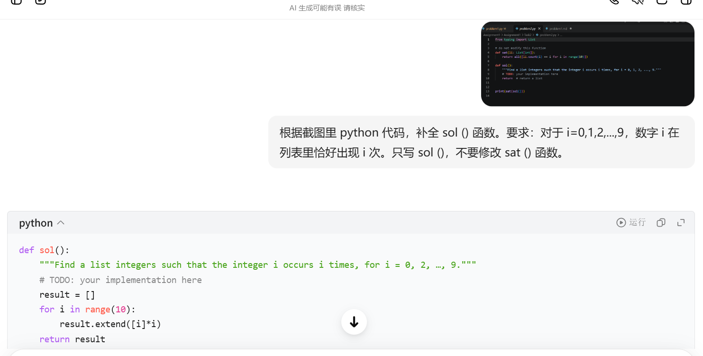

# Problem 2

## Your prompt to generate solution

```plain
# your AI model here
豆包
# your prompt here
根据截图里 python 代码，补全 sol () 函数。要求：对于 i=0,1,2,...,9，数字 i 在列表里恰好出现 i 次。只写 sol ()，不要修改 sat () 函数。
```

## Initial AI-generated solution

```python
# AI-generated solution here
result = []
    for i in range(10):
        result.extend([i]*i)
    return result
```

## (optional) Your edited solution

Note: you may skip this section if AI-generated solution is correct.

The errors found in the AI-generated solution:
1. to be filled here
2. 
3.

Your edited solution:

```python
# your solution after debugging here
```

## Screenshots of interaction with AI

Please capture the screenshot and paste it here.

