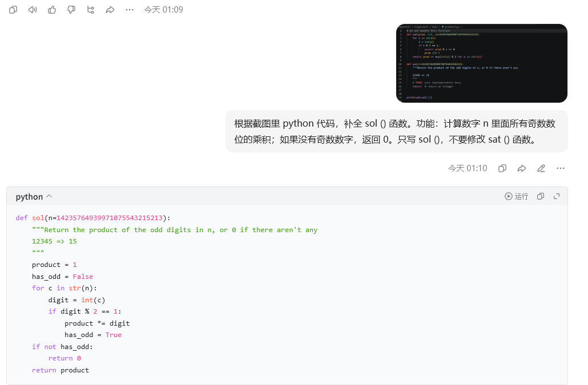

# Problem 4

## Your prompt to generate solution

```plain
# your AI model here
豆包
# your prompt here
根据截图里 python 代码，补全 sol () 函数。功能：计算数字 n 里面所有奇数数位的乘积；如果没有奇数数字，返回 0。只写 sol ()，不要修改 sat () 函数。
```

## Initial AI-generated solution

```python
# AI-generated solution here
product = 1
    has_odd = False
    for c in str(n):
        digit = int(c)
        if digit % 2 == 1:
            product *= digit
            has_odd = True
    if not has_odd:
        return 0
    return product
```

## (optional) Your edited solution

Note: you may skip this section if AI-generated solution is correct.

The errors found in the AI-generated solution:
1. to be filled here
2. 
3.

Your edited solution:

```python
# your solution after debugging here
```

## Screenshots of interaction with AI

Please capture the screenshot and paste it here.

