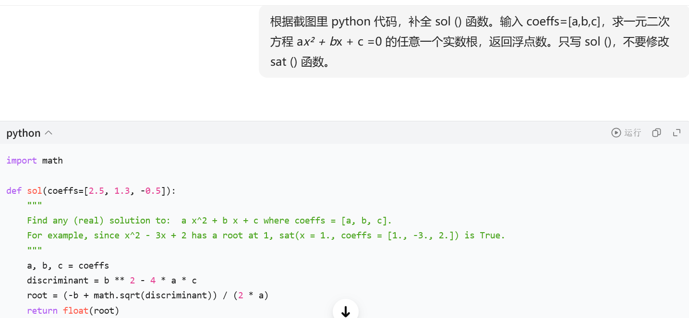

# Problem 5

## Your prompt to generate solution

```plain
# your AI model here
豆包
# your prompt here
根据截图里 python 代码，补全 sol () 函数。输入 coeffs=[a,b,c]，求一元二次方程 a*x² + b*x + c =0 的任意一个实数根，返回浮点数。只写 sol ()，不要修改 sat () 函数。
```

## Initial AI-generated solution

```python
# AI-generated solution here
import math

def sol(coeffs=[2.5, 1.3, -0.5]):
    """
    Find any (real) solution to:  a x^2 + b x + c where coeffs = [a, b, c].
    For example, since x^2 - 3x + 2 has a root at 1, sat(x = 1., coeffs = [1., -3., 2.]) is True.
    """
    a, b, c = coeffs
    discriminant = b ** 2 - 4 * a * c
    root = (-b + math.sqrt(discriminant)) / (2 * a)
    return float(root)
```

## (optional) Your edited solution

Note: you may skip this section if AI-generated solution is correct.

The errors found in the AI-generated solution:
1. to be filled here
2. 
3.

Your edited solution:

```python
# your solution after debugging here
```

## Screenshots of interaction with AI

Please capture the screenshot and paste it here.

